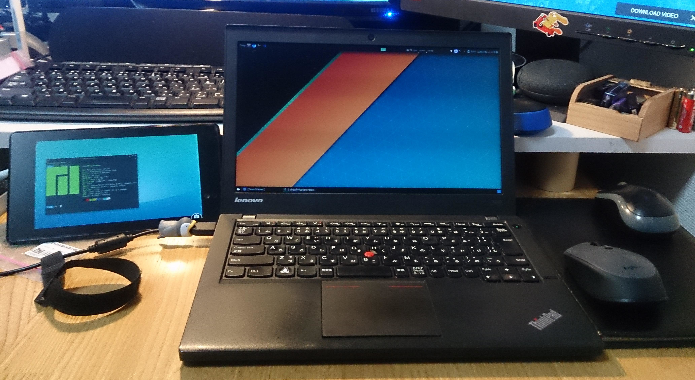

# Smartphone/tablet as second monitor for linux
Simple cli tool to create virtual monitor for Linux. You can use any remote desktop software(vnc,teamviewer ..) to connect to that monitor. 

- This tool uses xrandr so it will not work with wayland or your GPU does not support xrandr commands.

## Setup

### The hard way (not that hard :3)

This script is example of Nexus 7 2013 as second monitor.You may need to change 1920 and 1200 to the resolution of your tablet screen. You may also need to change LVDS1 if the default monitor's name is different.

<code>gtf 1920 1200 60 | grep -oP "\\".+"</code>

The output will be something similar to <code>"1920x1200_60.00"  108.88  1920 1360 1496 1712  1200 1025 1028 1060  -HSync +Vsync</code>. Copy everything into the next command.

<code>xrandr --newmode "1920x1200_60.00"  108.88  1920 1360 1496 1712  1200 1025 1028 1060  -HSync +Vsync</code>

<code>xrandr --addmode VIRTUAL1 1920x1200_60.00</code>

<code>xrandr --output VIRTUAL1 --mode 1920x1200_60.00 --primary --right-of LVDS1</code>

### The easier way
- Clone this git   
<code>git clone https://github.com/ChipCE/Smartphone-tablet-as-second-monitor-for-linux</code>
- Change directory   
<code>cd Smartphone-tablet-as-second-monitor-for-linux</code>
- Run install script as root and follow the instruction.   
<code>sudo ./install.sh</code> 
- run <code>vmon setup</code> to setup virtual monitor profile.   
This command need to be executed each time X server start.
- run <code>vmon enable</code> to enable virtual monitor. If success, you will able to se an additional monitor in "display" setting.
- Connect to host system using Teamviewr, VNC or any screen sharing program.
- To disable vmon, run <code>vmon disable</code>

## Configuration
### vmon configuration
- vmon config file are saved in /home/$USER/.vmon
- You can add more custom resolution into resoluton.conf file.
- Default resolution and default display(the main output display) can be set in vmon.conf.For more information about ouput displays and supported resolution profiles, run <code>xrandr</code> in terminal. 
### Other configuration (teamviewer)
- To show cursor in tablet screen, enable "show remote cursor" in teamviewer(tablet).   
- To connect with wlan, enable "incomming lan connection" in Extras > Options(linux).   
- To connect via USB cable, you need adb installed and forward Teamviewer port with <code>adb forward</code> or enable USB Tethering in android setting.   
- To turn-off VIRTUAL1 output, run <code>xrandr --output VIRTUAL1 --off</code> 

## Troubleshooting  
### 1.VIRTUAL1 not found error
If you get the output VIRTUAL1 not found error, create 20-intel.conf file:   
<code>sudo nano /usr/share/X11/xorg.conf.d/20-intel.conf</code>
Add the following configuration information into the file:
<pre>
Section "Device"
    Identifier "intelgpu0"
    Driver "intel"
    Option "VirtualHeads" "2"
EndSection
</pre>
and reboot.

### 2.Teamviewer error : Not ready. Please check your connection error
- Check if teamviewerd has been started, if not start it   
<code>systemctl start teamviewerd</code>   
- install <code>libicu</code> and restart teamviewer.
